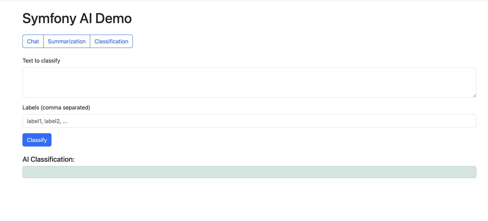
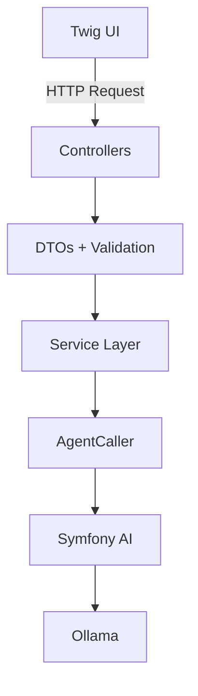

# **Symfony AI Demo**

## *Chat • Summarization • Classification using Symfony AI Bundle + Ollama*

[]()
[]()
[]()

A clean, minimal Symfony 8 demo showcasing:

* The **Symfony AI Bundle** (more info about *Symfony AI* [here](https://symfony.com/doc/current/ai/index.html))
* Clean service architecture
* DTO-based controllers
* Twig UI
* Unit + optional integration tests
* Dockerized stack (PHP-FPM + Nginx + Ollama)

This project is intentionally small and easy to understand — ideal for presentations, technical discussions, and learning how to use Symfony AI effectively.

---

## UI Demo

<p align="center">
    
</p>

---

## Privacy Disclaimer

*All inference runs locally on your machine via Ollama. No data is sent to external services.*

---

## Features Overview

### **Chat**

Send a message to the AI Agent.

### **Summarization**

Send text and receive a summary.

### **Classification**

Classify text using:

* user-provided labels
* or a fallback taxonomy defined by the default system prompt

### **UI**

Minimal Twig interface:

* Navigation bar
* Separate pages for chat/summarization/classification
* AI replies rendered via **Markdown → HTML**

### **Testing**

* **Unit tests** (fast, fully isolated)
* **Integration tests** (use real Ollama, opt-in only)

### **Architecture**

Clean separation:

```
Controller → DTO → Service → AgentCaller → Symfony AI Agent
```

---

## Architecture Diagram



---

## Minimum Hardware Requirements

Because this project uses **Ollama**, you need adequate resources.

### **Recommended:**

* **8 GB RAM minimum** (4 GB will crash or swap to death)
* **x86_64 CPU** (ARM64 works too, especially on Apple Silicon)
* **Docker Engine ≥ 24**
* **Docker Compose ≥ 2**

### **Tested With:**

* Debian 11
* macOS 26 (Apple Silicon M2)

Ollama automatically downloads `llama3.2` on first run (defined in docker-compose).

---

## Tech Stack

- Symfony 8
- PHP 8.4
- Twig
- Docker (Nginx + PHP-FPM)
- Ollama (local LLM)

---

## Getting Started

### 1. Clone the repository

```bash
git clone git@github.com:niccolovettorello1997/symfony-ai-demo.git
cd symfony-ai-demo
```

---

### 2. Start the Docker environment

```bash
docker compose up -d --build
```

Services started:

| Service | Port                                           | Description       |
| ------- | ---------------------------------------------- | ----------------- |
| Nginx   | [http://localhost:8080](http://localhost:8080) | Symfony frontend  |
| PHP-FPM | internal                                       | Runs Symfony      |
| Ollama  | 11434                                          | Local LLM         |

---

### 3. Prepare environment

```bash
cp .env.test .env
```

---

### 4. Install dependencies

```bash
docker exec -it symfony-php bash
composer install
```

---

### 5. Open the UI

[http://localhost:8080/chat](http://localhost:8080/chat)

With the navigation bar you can select:

* `/chat`
* `/summarization`
* `/classification`

---

## System Prompt Configuration

All system prompts used by the AI agents are fully configurable and centralized in the file:

```
config/packages/ai_system_prompts.yaml
```

This file defines the system-level instructions for each agent (chat, summarization, and classification).
Editing these values allows you to tailor the model’s behavior without modifying any PHP code.
Changes are applied automatically at runtime and take effect on the next request, making prompt iterations fast and convenient.

---

## Running Tests

### **Unit Tests (recommended default)**

```bash
php bin/phpunit --testsuite Unit
```

Covers:

* ChatService
* SummarizationService
* ClassificationService
* AgentCaller

---

### **Integration Tests (optional: requires Ollama)**

These run against the *real LLM*.

To avoid accidents, they only run if you explicitly enable them:

```bash
APP_ENV=test INTEGRATION_TESTS=1 vendor/bin/phpunit --testsuite Integration
```

This verifies:

* End-to-end message flow
* Correct system prompts
* Non-empty AI responses

---

## Project Structure

```
src/
├── Controller/
│   ├── ChatController.php
│   ├── SummarizationController.php
│   └── ClassificationController.php
│
├── Service/
│   ├── ChatService.php
│   ├── SummarizationService.php
│   └── ClassificationService.php
│
├── DTO/
|   ├── AIResponse.php
│   ├── ChatNewMessageRequest.php
│   ├── SummarizationRequest.php
│   └── ClassificationRequest.php
│
└── Utils/
    └── AgentCaller.php
```
---

## Code Quality: PHP CS Fixer & PHPStan

This demo also includes two quality-assurance tools to ensure consistent, safe, and maintainable code.

### **PHP CS Fixer**

Enforces coding standards (PSR-12) and automatically formats code.

Run formatter:

```bash
composer fix
```

This command applies PSR-12 rules to the entire codebase.

---

### **PHPStan**

Static analysis for catching bugs before runtime.

Run static analysis:

```bash
composer stan
```

This uses the Symfony PHPStan extension and analyzes both `src/` and `tests/` at level `6`.

---

## Motivation

This project was created as a simple, polished, understandable example showing:

   * Modern Symfony 8 patterns
   * Agent abstraction
   * Testing strategy
   * Clean service-layer architecture
   * Interaction with local LLMs

This repository acts as a *“reference implementation”* for cleanly integrating LLMs into Symfony without relying on external services. It is *not* intended for production use.

---

## Possible Extensions

* Streaming responses
* Agent and model selector
* Conversation history
* Multi-turn chat with context bag
* Selection of prompt presets
* JSON-mode classification results

---

## License

MIT License

---

**Author**

Niccolo' Vettorello

*Github*: [@niccolovettorello1997](https://github.com/niccolovettorello1997)
